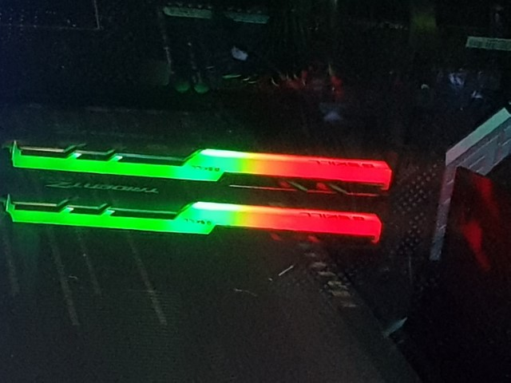

# RamMonitor

A small program to display RAM usage on my RGB RAM sticks using the ASUS Aura SDK.

# Usage

The RamMonitor project is a standalone application, all you need to do is build the program using Visual Studio or your preferred C# IDE, and run the executable.

The RamMonitorService project is a Windows service that can be added to startup, and doesn't require an open window to run. To add this service, follow the instructions from this page: https://docs.microsoft.com/en-us/dotnet/core/extensions/windows-service#publish-the-app

# Limitations

Currently both projects assume that your RAM has exactly 8 LED's. If this is not the case, it may not display properly.

(c) 2022 Yamboy1
